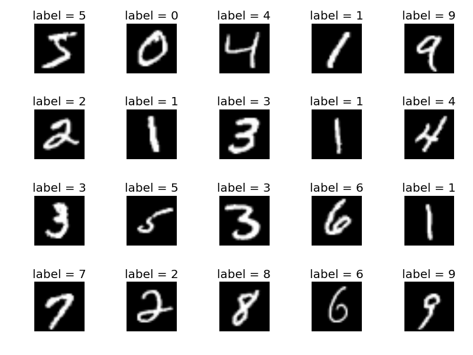

# WCGAN MNIST Keras
Wasserstein Conditional GAN implemented on top of Keras 2.0 (with TensorflowGPU back end) applied to the MNIST dataset.

## Vanilla GAN
Like in the Vanilla GAN, the generator and the discriminator of the WGAN are just simple multi-layer perceptrons

This is the algorithm for the WGAN extracted from the initial [paper](https://arxiv.org/abs/1701.07875) written by Arjovsky et al. in 2017:

## Data
The dataset used for this project is the MNIST dataset composed of a 70,000 images of handwritten numbers.

## Results
This is the progress on the Generator of my Vanilla GAN in only 100 epochs!
